#### Part-1

this is not intended to explain all the details of the os, what I want is to make something easy to understand, is it going to be perfect? no, when I have the choice to make something good technically or understandable  I'll choose understandable this readme's are intended to be read while you are reading  the source code.

simplest os possible!!!

####  First
when a computer powers on, a piece of code named [Bootloader](#Bootloader) loaded and takes the control of the computer


###### Bootloader
>the goal of the bootloader is loading the [Kernel](#Kernel) of an os from disk to main memory

###### Kernel
>heart of our os


#### Apply
with  this info what I'm going to do is write a [Bootloader](#Bootloader) that will print something, and loads a simple [Kernel](#Kernel) that itself just print some other stuff


#### Questions
"I said computer loads bootloader from disk to ram"
1. which disk?
2. where does it end up in the ram?

>which disk well there's no specific disk for example some specialized disk, what really happens is that
the software that is trying to locate the bootloader is looking for some signature, to be exact it checks every disk and read the first sector of 512 bytes and if that sector has `0xaaff` that is the bootloader so what we need is to put our bootloader in the first sector (sector 0) and put the value `0xaa55` look [here](#signature)

>well it will endup in the location `0x7C00`

##### Disk structure
here's [explanation](https://www.youtube.com/watch?v=wtdnatmVdIg)

and here's what you need for now
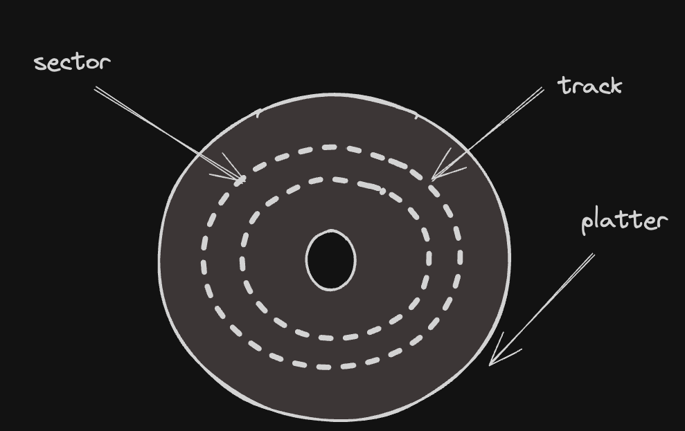

##### Real Mode
x86 architecture supports different operating modes that determine the processor's behavior and the software it can execute. one of them is real mode, and every mode has some constraints and some features, and every x86 os starts in real mode the most basic mode, why you asking I believe for compatibility reasons, for now don't worry if you didn't understand what is going on yet


##### memory segmentation in real mode
>we view memory as *addressable array of bytes* and that is usually how the *physical memory* look like, on top of this
>view, there's *logical view* in simple words just another way
>of seeing the same memory and this different way is called *x86 segmentation*, why you asking? think of scenario where you have two programmers writing two different programmes and
>if we used *physical* view of the memory one programmer could decide to write into location `0x89`, and other programmer also tries to write something there they will conflict each other and another problem like there's no separation between programme's so any program can read or write any location which leads to no security and a lot of stuff, but for now
>think of *x86 segmentation* just another way of seeing the memory, what do I mean by "seeing"? just different way to write/read memory.

**Details**

>In x86 segmentation the main memory is viewed as separated parts called segments and each segment stores a bunch of related data

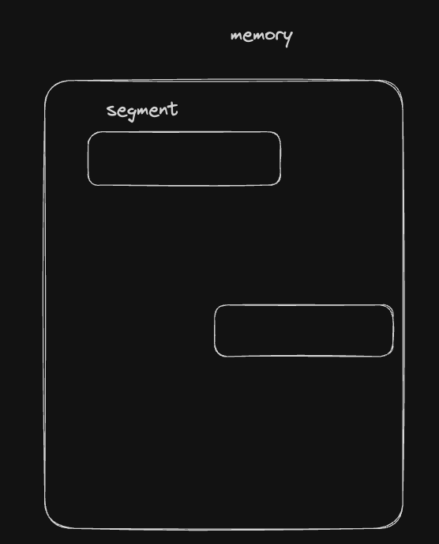

>To access data inside a segment, each byte can be referred to by its own offset

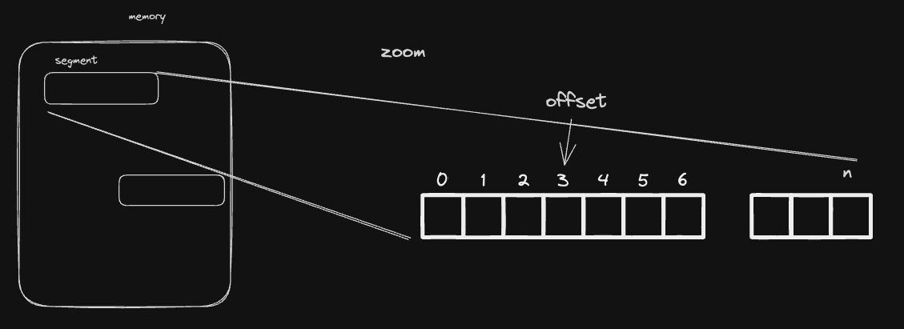

>The running program can be separated into three possible types of segments in x86, these types are: code segment which stores the code of the program under execution, data segments which store the data of the program and the stack segment which stores the data of program’s stack

>okay now we have this logical view of memory but at the end of day we need to access the ram, so we need some kind of mapping/translation between logical and physical, and this process can be done either by software or hardware in this case it's done automatically by cpu so yes it's done by hardware

>RAM hardware sees the data as a big array of bytes. Therefore, we need some tools to implement (map) the logical view of segmentation on top the actual hardware. for this purpose, special registers named segment registers are presented in x86, the size of each segment register is 16 bits and they are: CS which is used to define the code segment. SS which is used to define the stack segment. DS, and others.

>Each segment register stores the starting memory address of a segment

>assume that we have a code of some program loaded into the memory and its starting physical memory address is 100d, that is, the first instruction of this program is stored in this address

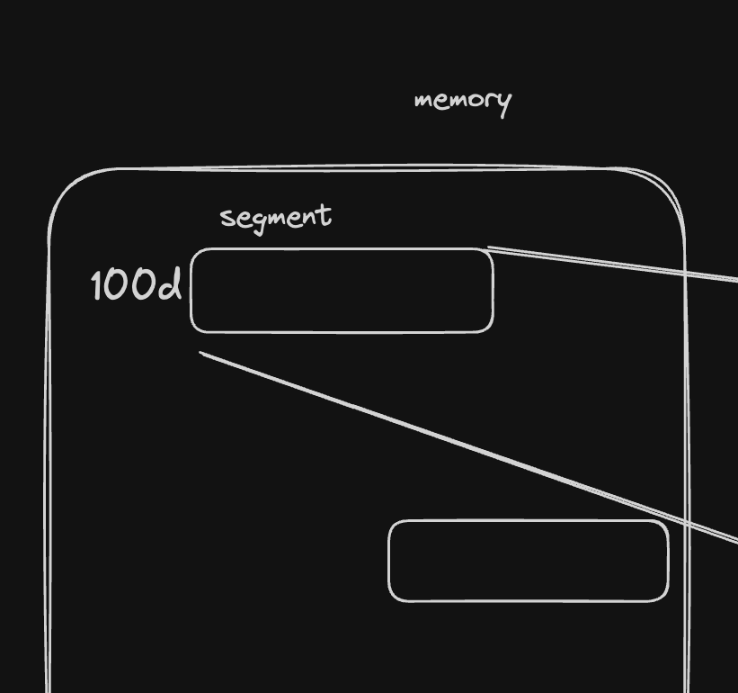

>To reach the first byte of this code we use the offset 0, so, the whole physical address of the first byte will be 100:0d

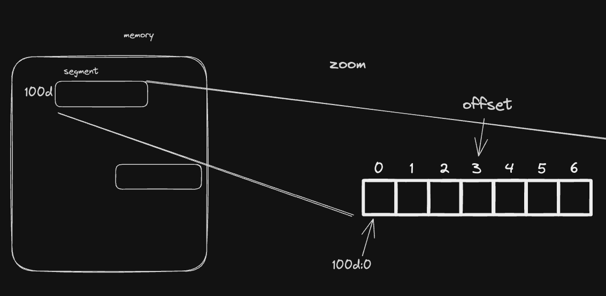

>To make the processor handle this piece of code as the current code segment then its starting memory address should be loaded into the register CS, that is, setting the value 100d to CS, so, we can say in other words that CS contains the starting memory address of currently executing code segment

>let’s say it is executing the following jmp 150d which jumps to the address 150d. What really happens here is that the processor consider the value 150d as an offset instead of a full memory address, the processor is going to retrieve the value of the register CS to know what is the starting memory address of the currently active code segment and append the value 150 to it. Say, the value of CS is 100, then the memory address that the processor is going to jump to is 100:150d.


##### Source Code Explained
###### Part 1
you maybe wondering why is [this](#set-data-segment) well that because x86 [real mode](#real-mode) memory segmentation wait what [memory segmentation](#memory-segmentation-in-real-mode) so when our programme is going to try access data like some string to print cpu will consult with ds register to find it that's why we set it

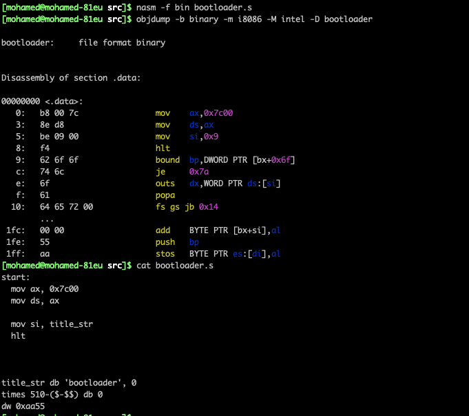
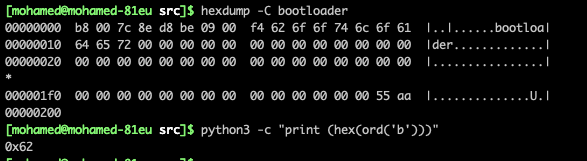
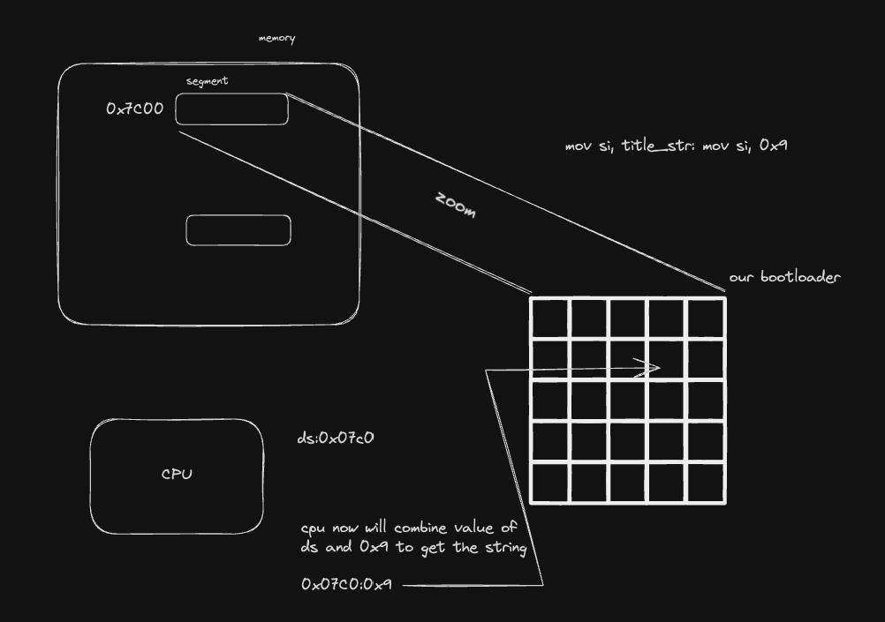

so if ds=0 cpu will try access 0d:0x9 which has nothing to do with what we are trying to do,
but why not

```s
mov ax, 0x7c00
mov ds, ax
```

didn't you say that our code is loaded at 0x7c00 well yes but the true value that should be in ds is 0x07c0 why ? well
that has to do with how the cpu uses the value in `ds` well first it shifts by 4 or multiply by 16, and then add the offset, for example access to that `title_str` will be like 
this ds * 16 + offset = 0x7c00+offset that is why!

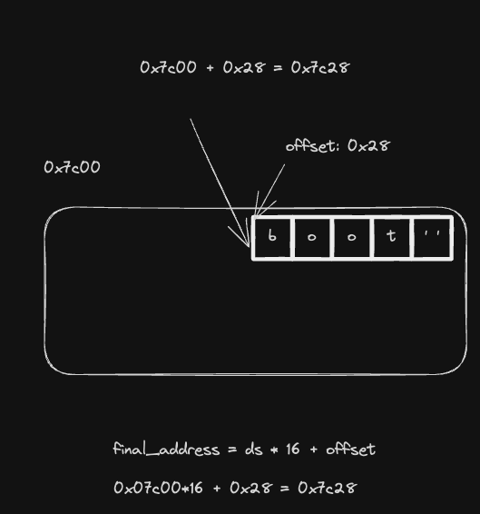

###### Part 2
let's see this <a href="#print_function_1">part</a> why move `0x0e` into `ah` register will I'm going to use BIOS to print something to the screen, well here's link to all [BIOS services](https://en.wikipedia.org/wiki/BIOS_interrupt_call#:~:text=BIOS%20interrupt%20calls%20can%20be,requested%20action%20to%20the%20caller.)
actually the value `0x0e` in itself is meaningless unless we take look at the other lines `int 0x10` well now it's good because now we are saying that we are interested in `video services` and I'm going to use `Write Character in TTY Mode`
so this combo

```s
mov ah, 0x0e
int 0x10
```

is saying that we want to print something to the screen, but what are we going to print well we put the value that we want to print into the register `al` and in our case `lodsb` is the one responsible, with this knowledge you should understand `.print_char` label, now let's move on to the part of `.print_done`

details of <a href='#print_function_2_1'>`.print_done`</a>
again if we take look at that table in the website that I gave you before you will see this

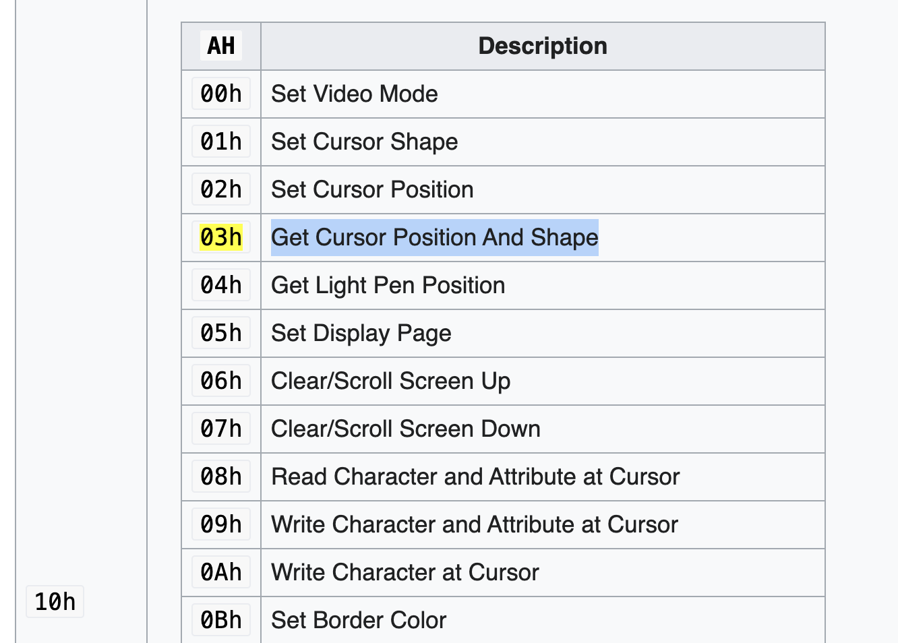

okay that explains this part

```s
mov ah, 0x03
int 0x10
```
okay what is the effect of this call? well it will change `cx` and `dx`

- CX: It holds the cursor's column position.
- DX: It holds the cursor's row position.

so that's why this part
<a href='#print_function_2_2'>exist</a>
```s
mov bh, 0
```
but what about that `mov bh, 0` well there's something called pages that I don't care about it for now in BIOS, somehow divides the screen into pages, and I don't want the other instructions to be applied to something else, so this is just defensive move here!!! 

###### Part 3
now we are going to load kernel from disk to ram
<a href="#load_kernel_part_3">set up what interrupt are we going to use</a>
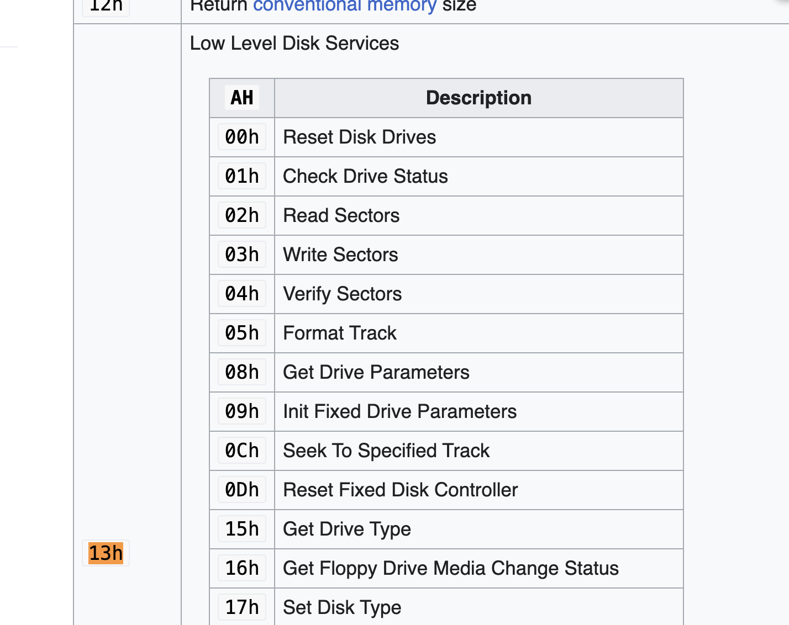

as you can see we are saying that we are going to read sectors, now we need to do some config!!

<a href="#load_kernel_part_2">config</a> value in `al` specify how many sectors to read, in this case one and remember every sector is 512bytes is enough? well for now, I'm going to make kernel that just prints something, so yeah it's enough, now becomes the question where is it (sector)
`ch` is used to specify the cylinder number
now becomes which track/sector, well that is `cl` we are saying that we would like to read the second sector, and
`dh` specify which track we are saying track 0.
The value of `dl` specifies which the type of disk that we would like to read from, the value 0h in this register means that we would like to read the sector from a floppy disk, while the value 80h means we would like to read from the hard disk #0 and 81h for hard disk #1...
the value of `bx` used to tell where data should be loaded into memory and 13h:02h will put the data in es:bx

so that is why <a href="#load_kernel_part_1">this is</a>

since bx=0x0 that means our data will be loaded into es:bx
which is 0x0800:0x0. we are done!!! now we need to do some
checks if load failed. when the content is loaded successfully, the BIOS service 13h:02h is gonna set the carry
flag to 0, otherwise it will be 1 we could use that, to execute other code that does some printing you can see the label `could_not_load_kernel` in `bootloader.s` file, now we need to create the kernel and put it right after the bootloader because in our code we are loading from the second sector take look at `kernel.s` and for now it's super easy because you already understand print function that is there, this [part](#kernel-code) may be weird to you well again if we remove this part the instruction `mov si, kernel_welcome` will use `ds` register as we said before, because `si` will hold only offset and `cs` has the correct value? well use because of this [part](#jump-to-kernel) in our `bootloader.s`

##### Source Code Parts

###### Print function

<span id="print_function_1"></span>
```s
mov ah, 0x0e
...
```

<span id="print_function_2_1"></span>
```s
mov ah, 0x3
int 0x10
```

<span id="print_function_2_2"></span>
```s
mov ah, 0x2
mov dl, 0x0
mov bh, 0
int 0x10
```

###### Load Kernel from dist to ram

<span id="load_kernel_part_1"></span>
```s
mov ax, 0x0800
mov es, ax
```

<span id="load_kernel_part_2"></span>
```s
mov al, 0x1
mov ch, 0x0
mov cl, 0x2
mov dh, 0x0
mov dl, 0x80
```

<span id="load_kernel_part_3"></span>
```s
mov ah, 0x2
int 0x13
```

###### signature 
```asm
times 510-($-$$) db 0
dw 0xaa55
```

###### set data segment
```asm
mov ax, 0x07c0
mov ds, ax
```

###### Jump to kernel
```s
jmp 0x0800:0x0
```

##### Kernel-code
```s
mov ax, cs
mov ds, ax
```


##### Makefile
you know that the first sector should hold bootloader and second sector should hold the kernel so you wanna be careful here,

after we got `bootloader.bin` and `kernel.bin` by using `nasm -f bin ...`  now we need to put one after another

```
dd if=bootloader.bin of=kernel.img
```

this is the first step we just copied binary from bootloader.bin into kernel.img now kernel.img hold the first 512 bytes,

```
dd seek=1
```

`seek` option says skip number of blocks in our case we are gonna skip 1 block, but what is the block size well that is why we set

```
dd bs=512
```

so we are saying block size is 512bytes, and since kernel.bin is shorter than 512bytes we use conv=sync option to say pad the rest with 0's so we end up with this

```
dd bs=512 seek=1 conv=sync if=kernel.bin of=kernel.img
```

#### Weird stuff
>sometimes I use `hlt` and sometimes I use `jmp $` I don't why `hlt` sometimes does not work so I default back `jmp $`