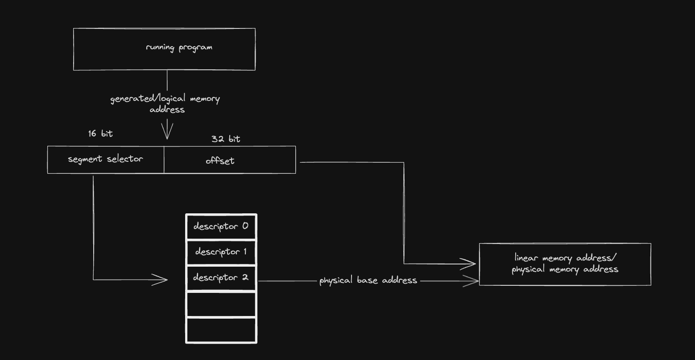

#### How to deal with memory
like before memory segmentation was easy in `real mode`, just put the memory address in the appropriate
segment register and you are done, in this case it's not, read [this](#protected-mode) to got idea, read it?
okay in short this is the new you can deal with memory

#### Switching ot protected mode
In x86, to be able to switch from real-mode to [protected-mode](#protected-mode), the
[global descriptor table (GDT)](#global-descriptor-table) should be initialized and loaded first.
After entering the protected mode, the processor will be able to run 32-bit code which gives us
the chance to write the rest of kernel’s code in C, when we switch to protected mode our ability
to use BIOS will be lost, and this is how we used to print to the screen like we did in part-1
so how are we going to print to the screen this is where *video memory* comes in, we are going
to use graphics standard known as *video graphic array (VGA)*

#### Protected mode
what is protected mode? well we have said in `part-1`, that in x86 architecture that the cpu has modes
like BMW Comfort Mode vs Sport Mode, some provide feature that the other lacks and vise versa, so
before we  have used `real mode` that has the consequence of how are we gonna use it because in that
mode you can use only 16-bit registers, and there's no such thing as memory protection, in Modern OS
we need some advanced features like memory protection, virtual memory multitasking ...
that is why we have `Protected Mode` so if our cpu is running in this mode, we can use these features
(memory protection...), the question now is how  do we switch from `real mode` to `protected mode`?
well can't we just start in `protected mode` unfortunately we can not because every x86 cpu start's 
in real mode for backwards compatibility, so yes we need somehow to switch from real-mode to protected-mode

###### Keep In Mind

###### Memory Protection
well In `protected mode` every `process` aka running program should be isolated from other processes
it could lead to `processes` corrupt each other memory which is bad and keep in mind that of the processes
that is running is your `kernel`, and you are not responsible for what it's going to run under it
for example `chrome` so I don't want `chrome` to jump for example to `kernel` code so we need some
mechanism to enforce it. this is when it comes `privilege levels`

###### Privilege Levels
read the part about [memory protection](#memory-protection).
The academic literature of operating systems separate the system environment into two modes,
kernel-mode and user-mode, at a given time, the system may run on one of these modes and not both of them
the kernel is runs on kernel-mode and has the privilege to do anything (access any resource of the system)
while the user-application run on user-mode which is restricted environment aka can't perform sensitive actions
x86 protected has feature that helps implement this which is called `privilege levels` and specifically
we **Four Privilege Levels** numbered from 0 to 3 being that 0 is the most privilege and 3 the lowest.
and by the way this `privilege levels` not just prevents user-mode application to not interfere with 
kernel, it also prevents user-mode from executing a sensitive instructions

###### Global Descriptor Table
<span id="GDTR_part1"></span>
is table that is stored in memory and it's starting memory address is stored in register called GDTR
**global descriptor table (GDT)**.
each entry in this table is called *segment descriptor* which has the size of 8 bytes and we can refer
to them by index number called *segment selector*
every segment descriptor defines a segment of any type (code segment, stack segment ...) and has enough
information that the processor needs to deal with the segment, for example the starting memory address
of the segment and so on, the segment selector of the currently running program should be stored in the
corresponding segment register for example if the segment descriptor is stored in the second raw of GDT
defines a code segment, `cs` should be 8 why 8 and not 1? well that because each segment descriptor
is 8 bytes so address of the second raw is 8 bytes from the start of GDT, let's dive deeper into the
[*segment descriptor*](#segment-descriptor-structure)

###### Segment Descriptor Structure
A segment descriptor is an 8 bytes entry of global descriptor table which stores multiple fields
and flags that describe the properties of a specific segment in the memory

one of the most important information about a segment is its starting memory address, which is called
the *base address* of a segment, when code refers to memory to read from it or write to it. it is actually
referring to specific segment, we call this memory address a generated memory address since it's not
referring to physical memory address, it should pass some translation like before `part-1`.
The logical memory address in x86 may pass two translation processes instead of one in order to
obtain the physical memory address. The first address translation is performed on a logical
memory address to obtain a *linear memory address* which is another not real and not physical
memory address which is there in x86 architecture because of paging feature. If paging is enabled
a second translation is needed that it takes *linear memory address* and it give us *physical memory address*
in our case I'm not going to use paging so one translation is enough. and here's how the translation
is performed



when running program generates a logical memory address, the cpu needs to figures out the physical
memory address,
1. *cpu* reads value of <a href="#GDTR_part1">**GDTR**</a>
2. then it uses *segment selector* in the generated address to get the right descriptor in **GDT**
3. then the *cpu* uses the the obtained descriptor to get physical base address of the segment
4. and finally the *cpu* add  32-bit *offset* to *physical base address* to obtain **linear memory address**

During this operation, the processor uses the other information in the segment descriptor to enforce
the policies of memory protection. One of these policies is defined by the *limit* of a segment which
specifies its size, if the generated code refers to an offset which exceeds the *limit* of the segment
the *cpu* will stop it.


because if the cpu did not stope code can give a bigger offset to reach **Other segment** which should
not be possible.

<div style="color: Cyan; font-weight: bold">Details</div>
<span id="limit_details"></span>
*limit:* is stored in 20-bit segment limit field for example if this filed has the value of 45d it means
that the limit of this segment is 45 what? 45 bytes? 45 bits? 45 gigs? ... well that depends on <a href="#granularity_flag_details"> granularity_flag_details flag</a>
that means if granularity flag is 0, it will be 45 bytes, otherwise it will 45 * 4KB

<span id="granularity_flag_details"></span>
*granularity flag:* when the value of this flag is 0 then the value of the <a href="#limit_details">limit field</a>
is interpreted as bytes, otherwise the value of segment limit field will be interpreted as of 4KB units


##### Segment Type
let's say cpu has segment selector 5, so it will use it to get segment descriptor, but cpu now need
more info about type of segment (code, data, ...) to know how to deal with it.
These two types of segments (code and data) belong to the category of application segments,
there is another category of segment types which is the category of system segments and it has many
different segment types belong to it. Whether a specific segment is an application or system segment,
this should be mentioned in the descriptor of the segment in a flag called <a href="#descriptor_segment_type">*S flag* or *descriptor type flag*</a>
When the value of S flag is 0, then the segment is considered as a system segment
while it is considered as an application segment when the value of S flag is 1, for now we will deal
only with application segment, but we still need to tell the *cpu* what type (data or code...)
To answer this question for the processor, this information should be stored in a field called </a href="type_filed">*type field*</a>
Doesn’t matter if the segment is a code or data segment, in the both cases the least significant bit
of type field indicates if the segment is **accessed** by accessed we mean did we read from it or write
to it before if so the least significant bit of type field is 1 otherwise it's not,
The value of this flag is manipulated by the processor in one situation only, and that’s happen
when the selector of the segment in question is loaded into a segment register now let's dive deeper
into specific segment types

###### Code Segment Flags
- when you have code segment you can set *read-enabled* flag. the value of this flag indicates
how the code inside the segment in question can be used, when the value of *read-enabled* is 1,
that means the content of the code segment can be executed and read from, okay why would you want
to read from code segment? well you may have constants there. and if value is 0 you can only
execute, when *read-enabled* is 1 the selector of this segment can also be  loaded into one
of data segment registers


- *conforming flag* if this flag is 1 it means that the segment code can be executed by less privilege code, why would you do that? Imagine you have library, for security reasons library
is better to be executed on less privilege levels, but library may need some system-level code
residing in a higher privilege level so the code segment that contains this system-level code
can be *conforming*


###### Data Segment Flags
we can make data segment read-only by setting something called *write-enabled* flag to 0, 
and if flag is 1 it means we can read from it and write to it


and if data segment represent **stack segment** there's another interesting flag is called
*expansion-direction* flag, if this flag is 0, the data segment is going to expand **UP**
otherwise is **DOWN**

<div style="color: #c132fa; font-weight: bold; font-style:italic">note all data segments are non-conforming</div>

###### Segment's Privilege Level
I have mentioned a lot of times *privilege level* every segment can belong to some level, and in
x86 protected mode we have 4 modes (0, 1, 2, 3) 0 most privilege level 3 least privilege, and
this value is stored in something called *descriptor privilege level (DPL)* field


###### Segment's Present
usually programs are stored in secondary storage devices (hard-disk, usb, ...) when you double-
click on program, so new segment will be created that should point to the code segment for
example and creating a segment is relatively fast compared to loading data from disk to ram
for example so there might be situation where segment does exist but it points to corrupt data
that's why we have flag called *segment-present* if it's 1 it means that the data is present
in the memory otherwise is's not, and this helps the processor to decide whether data is there
or not, if not and we tried to use the segment the processor will be able to generate error
based on this flag


###### Other Flags
if you have been following you will see that we have 3 bits free
the name of the first one changes depending on the type of the segment
- if segment is code segment we call it *default operation size (D flag)*. when the processor
executes the instructions it uses this flag to decide the length of the operands, depending
on the currently executing instruction, if value of D flag is 1 the processor is going to assume
the operand has the size of 32 bits if it is a memory address, and 32 bits or 8bits if it is not
memory address, if value is 0 that means 16 bits if it is memory address, and 16bits or 8 bits 
if it's not memory address.

- if segment is stack segment we call it *default stack pointer size (B flag)* refers to the
size of memory address which points to the stack, if 1 it means 32bits and it's stored in esp
otherwise it's 16bits and it's stored in sp.

- if segment is data segment that's growing upward this flag is called *upper bound flag
(B flag)*, when its value is 1 the maximum possible size of the segment will be 4GB, otherwise, the maximum possible size of the segment will be 64KB

**anyway, the value of this D/B flag should be 1 for 32-bit code and  data segments (stack segment is just data segment so yes it's included) and it should be 0 for 16-bit code and data segments**

now let's move on to other flags, there's flag called *64-bit code segment (L flag)*. if the
value of this flag is 1 that means the code inside the segment is a 64-bit code while the value 0
means otherwise, when we set the value of L flag to 1 the value of D/B flag should be 0


the final flag this flag has nothing to do with processor you can us it the way you like by you
I mean (your operating system)

###### Structure of GDTR
we said before that *GDTR* is register that stores *physical address* of *GDT* well that is true
but not the entire story, because in the same register we store the limit of *GDT* aka size of *GDT*


and to change the value of this register you can't just `mov gdtr, value`, there's special instruction
called `lgdt` takes one operand and that is the whole value (gdt address and size), and BTW the size
part does it represent how many segment descriptors can it hold? or size in bytes that's it? well
size in bytes that is all, so if limit=16  it means 16 bytes it means 16/8=2 segment descriptors.

###### Segment Selector
we have said that segment selector is just index in *gdt* well that's true but, there was detail that
I didn't mention at the time, x86 is not providing *gdt* only it provides something called
*ldt (local descriptor table)* also, which i'm not going to talk about it for now at least, so segment
selector is index yes, but in which table *gdt* or *ldt*? well segment selector is 16bit look at the picture


- TI (table indicator): if 0 we are dealing with *gdt* otherwise *ldt*
some other details there's something called current privilege level (CPL) and descriptor privilege level
(DPL), CPL has to do with the currently running code, DPL says that this segment belongs to this level
and there's also RPL

**RPL (request privilege level)**
let's say that process A is running in (ring 3) user mode privilege level 3, and it tells kernel I need
segment B which is kernel segment for example, since kernel is in privilege level 0 or (ring 0) he can
simply load the segment selector and cpu will not stop it, and after that it (kernel) will give it back
to process A, which shouldn't happen, that's when it comes *RPL*, which it stores the *requester*, so
the same scenario would not pass, because yes the kernel will load segment selector but he will put
in *RPL* field 3, saying that hey i'm running on level 0 but I'm not the one who want it, someone on
level 3 (process A) who does, so the cpu will stop it.
The x86 instruction *arpl* can be used by the kernel’s code to change the RPL of the segment selector
that has been requested by less-privileged code to access to the privilege level of the caller

#### Interrupts In x86
in x86, both hardware and software can interrupt the processor, system timer is one example of
hardware interrupt while software interrupt can occur by using the x86 instruction *int* and has
one operand it's the *interrupt number*, when the processor is interrupted by this instruction
for example *int 0x10*, it is going to call the *handler (specific function to handel certain even for example button press, load from disk....)* software interrupt can be used to implement
what is called *system calls*, which provide a way for user applications to call specific kernel's
code that gives the applications some important services (creating directories for example)
and there's something called *exceptions* that is related and the difference between them
is that *exceptions* occurs when an error happens in the environment (division by zero), again
to deal with interrupts we have table like *GDT* called *IDT (interrupt descriptor table)*
it resides in the memory and tells the processor how to reach to the handler of a given interrupt
each entry in this table *IDT* is called *gate descriptor* and it's also 8 bytes of size, at most *IDT* can contain 256 *gate descriptors*, base memory address of *IDT* is stored in *IDTR*
register, like before when we were talking about *segment descriptor* they were describing
a segment *data or code ...* and the same way here *gate descriptor* describes interrupts and yes
we have multiple types of interrupts *task gate*, *interrupt gate* and *trap gate*, for now we
will not focus *task gate* and here's how *gate descriptor* look like


*gate descriptor* should have some info about it's *handler* and as you can see from the picture
that in bytes 2 and 3 there's segment selector which is selector for segment descriptor of handlers'
code so when the processor gets interrupted it will get *gate descriptor* and extract from it
*segment selector* and use that *segment selector* in *GDT* to find base address of that segment

*offset* in bytes 0, 1, 6 and 7 will be the offset in segment that points to the first instruction
of the handler, why this design? well because the handler could be just one part of the whole
code, or maybe I can put multiple handlers and use the offset to handel different ones
*P flag* when it 0 that means the code this descriptor is pointing to is not loaded into memory
while the value 1 means otherwise

*DPL* contains the privilege level of the handler

*gate descriptor* should be like this D11T. The flag which is called D here specifies the size
of the gate descriptor itself whether it is 32 bite when D=1 or 16 bits when D=0, in our case
it will be 1, The flag which is called T specifies whether the gate is an interrupt gate, when
T=0 or trap gate when T=1, what is the difference between them you ask, when we are dealing
with *interrupt gate* when it is called the processor will disable the ability to signal another
interrupt (that's not entirely true NMI), on the other hand *trap gate* can be interrupted while
executing (processor does disable interrupts)

we still have a question how does the processor knows that this interrupt should be handled
by this handler?

well that depends on the index of the *gate descriptor* let's assume the I had put *gate descriptor*
at index 0 of IDT


then this code will be called when the interrupt number 0 is signaled you can think of interrupt
number as index in IDT

In protected-mode, interrupt numbers, that is IDT entries indices, from 0 to 21 have specific meaning defined by x86 architecture itself, for example, the interrupt number that is reserved for division by zero exception is the interrupt number 0, he range of interrupts number from 22 to 31 are reserved
and the interrupt numbers from 32 to 255 are available for the system programmer to decide
their meanings,

##### Interrupts in more detail (HOW TO SETUP)
since interrupts can come from software and hardware and for example they can come come from
buttons, disk, ..., so the processor cannot be connected to all these devices via dedicated wires
this is where *PIC programmable interrupt controller* comes in that will be connected to the cpu
and to the devices that can interrupt

well with this configuration the cpu will see that there's interrupt via (int-intr) wire but how
does it (cpu) know what device is responsible for it so it can handel it correctly, we need extra
lines

most *pics* at least the ones I know can connect to 8 devices at most like
*8259A* is that it? we can not handel more than 8 devices? fortunately we can

this is general picture not all the picture go to wikipedia for that
now let's see what is going on in our case x86 cpu, the pc uses 2 of these chips to allow more
than 8 devices to interrupt


now we have 15 interrupt lines, BTW these pics can work with multiple architecture 8085/8086...
so we somehow need to tell it that we are in x86 environment, actually pic needs more configuration
so how the cpu is going to communicate with this device (pic) there are two well-known type of
communicating with external devices by the processor, either by video memory like VGA stuff, this
type of communication is known as memory-mapped I/O, that is the main memory is used to perform
the communication.
there's another type which is used by PIC nad this type is known as *port-mapped I/O* communication.
this method, each device (that uses this way) has ports each port has it's own unique number and job


for example master PIC has two ports, the number of the first port is 0x20 while the second port
is 0x21, the first port is used to send commands to the master PIC, while the second port is used
to write data on it so the master PIC can read it.
The same is applicable to slave PIC with different port numbers, a0h and a1h respectively. PIC has no explicit command to remap IRQs, instead, there is a command to initialize PIC, this initialization consists of multiple steps and one of these steps it is to set the required mapping. why this mapping?
well when a device send interrupt to the PIC, PIC should send this request to the cpu, in this
stage each IRQ number is mapped to an interrupt number for the cpu, for example IRQ0 will be sent
to the cpu as interrupt number 8, and that may conflict with other interrupts that we have set
in *IDT* for example interrupt number 8 is used by cpu to resolve *double fault* so we can not
let system timer on the same interrupt number

**Remapping Pics:**
since PIC is a port-mapped I/O and by using *out* instruction od x86 we can write something on a
given port number.
the *initialization command* of PIC is represented by the number 0x11, which means writing this
value on the command port of PIC by using out instruction is going to tell the PIC that we are
goint to initialize it.  When we send this command to the PIC through its own command port
(20h for master PIC and a0h for slave PIC), it is going to wait for us to write four parameters 
on its data port
- the first parameter that we should provide is the new starting offset of IRQs, for example the
value of this parameter is 32 why 32? as we said before we can play with interrupts starting from
32 to 255, that means when IRQ0 will be sent to the processor as interrupt number 32d, the cpu
is going to use it as index into *IDT*
- The second parameter tells the PIC (that we are initializing) in which of its slot the other PIC is connected
- The third parameter tells the PIC which mode we would like it to run on, there are multiple modes for PIC devices, but the mode that we care about and need to use is x86 mode.
- The fourth parameter tells the PIC which IRQs to enable and which to disable

```s
mov al, 0x11

; init master pic
out 0x20, al
; init slave pic
out  0xa0, al

mov al, 32
;telling the master that you should start at 32
out 0x21, al

mov al, 40
;telling the master that you should start at 40
; why 40 you may ask? well 8 for the master so its normal that we use 40

out 0xa1, al

mov al, 0x4
; telling the pic where slave is connected
; but should not be 0x2 instead of 0x4 well its. its just different encoding
0x4 = 100 what is happening is that we should set the right bit which is bit at index 2
out 0x21, al

mov al, 0x2
; telling the slave where the master is connected with you
out 0xa1, al

; telling the master and slave that we are working with x86
mov al, 0x1
out 0x21, al
out 0xa1, al

; enable all irqs
mov al, 0x0
out 0x21, al
out 0xa1, al

ret

```
now we need now is to setup *IDT* look into `load_idt` label you can see it's the same as loading
the *GDT*, now we just need to define the interrupt handlers
look inside *idt.s* you can see that theres *isr_0 to isr_31* we said before that the first 32
interrupts are reserved but we still need to define them, here's the choices that I had either
handel what should happen in the assembly function itself something like this

```s
isr_13:
    cli
    call isr_impl_13 ;handel it here by calling
    ret
```

or make common function that all of them should call like `isr_basic` and I can only
write one function in c file that will be called in it `(isr_basic)`,
but how does the function differentiate between isr's well we could pass parameter
like some integer that says hey this is interrupt 13 for example well
that's what I did by pushing the value `pop number`, let's now look into `isr_basic`
well we call `interrupt_handler (c function)` after we clean the stack by `add esp, 0x4`
and we enable interrupts again, and after we return from then function but why use `iret`
instead of `ret`, well because `isr_basic` is not normal function because when it's called by
the cpu a lot of stuff changes like privilege level and segments because the corresponding 
gate descriptor is probably in another segment descriptor, and `ret` does is just take value
on the stack jump to it, which is not enough in this case because after `isr_basic` is done the
cpu needs to restore the previous state segment registers maybe other registers some flags and so on
so that is why we should use `iret`, now you may have question why there's isr_x and irq_x
and after all they both seem to handel it with the same function hence they both called 
`interrupt_handler`, well you know that starting from 32 we are dealing with *PIC* aka interrupts
are coming from *PIC* unlike other interrupts for example the ones `isr_0 to isr_32` *PIC* device
needs to know whether the interrupt is handled by the CPU or not so it can move to another 
interrupt, so what is different in `irq_basic` is that we are telling the PIC devices that
we are done handling you could move on, illustrating example assume that disk and timer are connected to *PIC* and both of them interrupt now *PIC* is ordering them based on who's lower
i.e who has lower interrupt number for example disk:9 timer:8, timer should be handled first
so PIC will interrupt the cpu and says he timer should be handled now, so if we handel it the
same way we did in `isr_basic` *PIC* device will be just waiting for the cpu to tell it I'm done
with timer so it *(PIC)* can move on and interrupt it again with disk, so that's why we need
to communicate with *PIC*
so I'm sending 0x20 aka end of interrupt to master always if interrupt was coming from slave
PIC we send it to salve also that's why there's that `jnge`, now we fill that *IDT* well if you
read about gate descriptors before you know that we should set where the code is, and DPL ...
here's example of entry in *IDT* `isr_0, 8, 0x8e00, 0x0000` saying to cpu if interrupt happens
for this entry you should look in segment descriptor 8, then you can get a base address and then
use isr_0 as offset to reach the first instruction of isr_0, and other values 0x8e00, 0x0000
define type of it and privilege level as you know for all the details go back to the section
that talks about *IDT*


**Notes:**
- There is a standard which tells us the device type that each IRQ is dedicated to, for example, IRQ0 is the interrupt which is received by a device known as *system timer*


##### Register IDTR
it has the same structure as *GDTR* 32bit of linear address and 16 bit size


###### Locations
<div style="color: #0d8c88; font-weight: bold">segment base address</div>
least significant bytes are stored in bytes 2, 3 and 4, and most significant byte is stored in byte 7


<div style="color: #0d8c88; ">segment limit</div>
The bytes 0 and 1 of the descriptor store the least significant bytes of segment’s limit
and byte 6 stores the most significant byte of the limit, now you may be wondering what part
of bytes 6 holds the remaining 4 bits look at picture for reference

- Bits 0-15: Segment Limit (Low)
- Bits 48-51: Flags and Limit (High)


<div style="color: #0d8c88; font-weight: bold">granularity flag</div>
The granularity flag is stored in the most significant bit of the the byte 6
- Bit 55


<div style="color: #0d8c88; font-weight: bold" id="descriptor_segment_type">S flag/ descriptor segment type</div>
it's in bit 5 of byte 5
- Bit: 44


<div style="color: #0d8c88; font-weight: bold" id="type_filed">type filed</div>
Type field in segment descriptor is the first 4 bits of the fifth byte
- Bits 40-43
the most significant bit specifies if the application segment is a code segment
(when the value of the bit is 1) or a data segment (when the value of the bit is 0). 


#### Makefile Explained
- starter.s: initializes and loads the GDT, change operating mode
- main.c: kernel in protected-mode this comes after start.s


#### Source Code Explained
>well it's a bit different now than before (part-1) because now I intend to make my kernel do
different stuff compare to before (just printing), so the kernel would probably take more than
512bytes or 1 sector, so our bootloader should load multiple sectors into memory first

##### bootloader.s

<span id="load_kernel_part_1"></span>
```s
mov ax, [curr_sector_to_load]
sub ax, 2
mul bx
mov bx, ax
```

remember that `bx` is used as destination combined with `es` will for the first iteration when
`curr_sector_to_load` is 2 I need `bx` to be 0, and to be 512 when the value is 3 and so on.
how would I do that? easy

>bx = (curr_sector_to_load - 2) * 512

and why we start at curr_sector_to_load=2 well that is straightforward because our bootloader is
at section 1 and I will put the reset (kernel) after aka sector 2, and by `I will put` statement
that will be because of the makefile

### starter.s

```s
bits 16
```

why is this you asking again look at the makefile and you  see that in this case I'm not using
`nasm -f bin` but instead I'm using `nasm -f elf32` which by default generates 32bit code, which
I don't want since we are still in real-mode not in protected-mode, so why don't compile it with
`nasm -f bin` well I want the starter.s to be linkable with main.c


```s
call load_gdt
```

take a look at `gdt.s`, and you will see gdt entries and after that a label that has size and base address
inside *load_gdt* I set it to gdtr via *lgdt* instruction why *cli* well I saw in intel manual
that we should disable interrupts before we run *lgdt*. you maybe wondering of what are the values
in gdt entries, you you could follow what I said before about segment descriptor and you can encode them for example in `kernel_code_descriptor` base is 0x0, and limit is 0xffff, and segment
is application segment and it's non-conforming, and you should be able to deduce the rest

```s
call switch_to_protected_mode
```

in order to understand this function you should know that in the processor there's something called
*control registers* named from cr0-cr7. and these registers contain values that determine the
behavior of the processor for example, the last bit of CR0, that is bit 31 indicates that paging
is enabled when its value is 1, in our case first bit of CR0, bit 0 determines is protected-mode
enabled or disabled if 1 enabled and that's what I'm doing in this function `switch_to_protected_mode`

```s
call init_video_mode
```

again this is just another BIOS call to setup video mode because the moment we are in 
protected-mode we will not be able to use BIOS, if you follow the interrupt table that was
on wikipedia in part-1 you can see by setting al to 03 we are requesting to text mode with 16
colors and the other interrupt when cx = 0x2000 means that I'm requesting to disable cursor
since the user should not be able to write something.


#### Result

