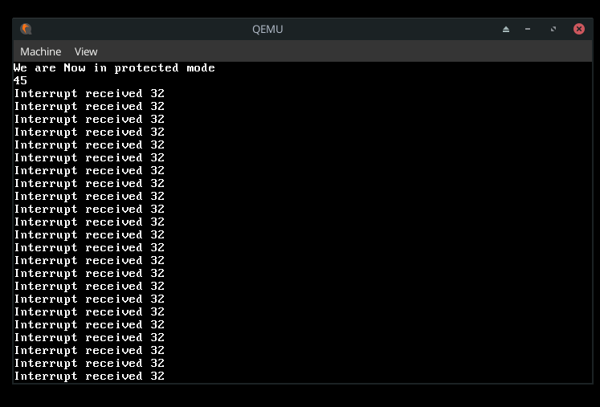
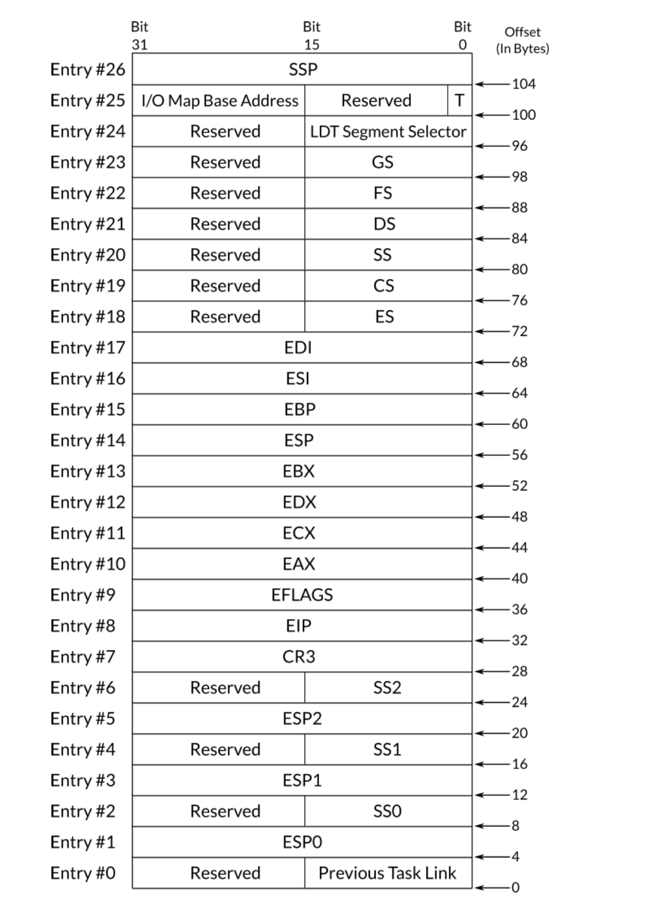

#### Multitasking
this for me is the most important part because it fascinating how one cpu and os gives the illusion
of multiple things happening at the same time (running chrome, listening to music, playing, ...)
so how is this possible?

### General <span style="color:lightblue; font-weight:bold; font-style:italic">"theory"</span>
### *Process Management*
- one of the responsibilities of the kernel is to manage resources for example *cpu time*, kernel
should manage adn distribute *cpu time* among a bunch of <a href="#keywords_process">processes</a>
- and kernel achieve this by keeping a table of PCBs look into <a href="#notes">Notes</a>
- each process is known to have a *state*, when it is loaded to memory its state will be as
*ready* thus can be run anytime, when CPU is executing it it's state will be *running*, the 
state of process can be waiting, an example of a situation where process state is changed to waiting state is when it performs I/O request (read disk, ...), this info also stored in PCB

#### Multiprogramming and Time-Sharing
In the days of mono-tasking (one thing at a time), there was problem, that the cpu tends to be
idle long time for example if the process is waiting for I/O the cpu is just waiting aka idle
so valuable resource of *cpu time* is wasted, this is why we have multitasking in the first place
and by having that table of PCBs that are in  the ready state, the kernel can switch between them
minimizing waste of *cpu time*
let's say you have this scenario a process A is executing and now it wants I/O, the kernel now
can suspend process A and give the *cpu time* to another process say process B, this switching is
known as *context switch*, the process is executing and at some point it will stop either it's
done or it self done something that keeps the cpu idle (like reading from disk), again the kernel
will try to switch to another ready process this is multiprogramming, and here's another approach so instead of waiting for a process to do something that will make the cpu idle we can 
just snatch it and give it to another process kernel can just stop it
when X amount of time has passed and switch to another one and so on, this solution is known as
*time sharing* until now we have only theory how can we implement?
<div style="font-weight:bold; color:cyan">Details:</div>
remember this from previous part



you can see that we repeatedly get interrupt 32, well that is the system timer which emits an
interrupt every unit of time, we can use this interrupt to implement time sharing, so when ever
we get this interrupt we switch to another process using that the table of PCBs, let's say
process A is running and we kernel got this interrupt so now we will switch but switch to which
process? should it process A again ? well that does not seem good maybe B maybe C,  so you can
see that we need some algorithm to decide what process executes next, this kind of algorithms are
known as *scheduling algorithms*, *scheduler* is the part of the kernel that schedules the next
process by using some specific scheduling algorithm, for me it just fancy word for *scheduling algorithm implementation* In my case I'm going to just implement *round-robin* which is extremely
simple

<div style="font-style:italic; font-weight:bold; color:lightgreen">round-robin:</div>

in this algorithm each process is given a fixed amount of *cpu time* known as *quantum* for example 100ms,when the running process finishes its *quantum* the *scheduler* will be called and 
the *cpu time*  will be given to the **Next Process**, and when this *next process* finishes its 
*quantum* we move to the next process until we reach the end of the table and we loop back to 
the start now you can see where the name *round-robin* comes from

#### Preemptive and Cooperative Multitasking
both multiprogramming and time-sharing solutions give us a type of multitasking known as
preemptive and cooperative multitasking, the process are forced by the kernel to give the
*cpu time* to another process and no process can take over the processor for the whole time.
another type of multitasking is known as *cooperative multitasking* (or non-preemptive multitasking)
in this type the context switching is not perform forcibly, instead the currently running process
should cooperate and voluntarily tells the kernel when it should be suspended and context switch should be performed. One of the obvious problems of this way, at least for the well-known workloads (e.g. servers or desktops), that a process, which runs a code that has been written by someone we don’t know, cannot be trusted. It simply may take over the CPU time and never cooperate and give it up due to an error in the code or even in purpose 

#### Process Context
we said before that we just switch to another process well it's not that simple because when a
process is running it's in some state (and no I'm not talking about the states:running, waiting...)
I'm talking about process have specific values in specific registers and some stack values and so
on and the moment we want to switch it's (process) already not in it's first instruction, so
we can not just discard this info and jump to another location "next process" because when the
moment reaches and we want to switch to the previous process are we going to start from it's 
starting address again well no because if we did we would never progress in that process we need
to jump where we left and that require us to know some info like where should we jump to what
are the values of the registers at that point what the stack look like and so on, all this values
are known as *process context*

When a scheduler decides to change the currently running process, let’s call it A, through a context switch, a copy of the context of the process A should be taken and stored somewhere, that is, a snapshot of the last context of A is taken before switching to another process. By taking this snapshot, it will be easy later to resume process A by just loading its context to the processor’s register and jump to the the value of EIP which has been just loaded.

#### Theory Done Let's Go Practice
- we can use system timer *(remember the interrupt we got repeatedly interrupt 32)* to implement
multitasking fully by the kernel, that is by code. this type is known as *software multitasking*
and yes it's not fully software because we still need *system timer* BTW this is my perspective,
it means that our kernel is responsible for storing the list of processes that we have said,
(remember the table contains PCBs as their entry) and performing context switching and so on.
- in x86 some features are provided to handle these things with the assistance of the processor
itself, this type is known as *hardware multitasking*, which I'm not going to focus much on it
because I'm going to implement *software multitasking* and that is because I'm not that good
at hardware yet, and another reason is that in modern operating systems they tend to use as
little as possible *hardware features* and that's because of portability to other architectures
other than x86, we are going to see some basics, so if we need some configuration we'll be ready

##### Task-State Segment
task is usually referring to process, *Task-State Segment* as the name suggests it's just segment
in memory it's the almost the same as any other segment (code, data, ...), the difference is that
TSS (task-state segment) is a system segment not application segment, this segment stores the 
context of specific process. and here's the structure of this segment



when we are using *hardware multitasking* each process should has its own TSS descriptor. you can
see that in this segment we are storing a lot of stuff most are register values and remember
when we were talking about process context we said that we need to store the process context
so we can get back to process and continue well this what would help us achieve this in 
*hardware multitasking* yes there are some other fields that I have no idea for now, I understand
that we need ebx, eax, ..., so we can restore process, but I did not know why we have four SS
and 4 of ESP, well it turn's out that if the process is running in privilege level 0 it will
use SS0:ESP0 and so on, so that's why they seem duplicated, I'm reading a book right now and he
says that even if you don't implement *hardware multitasking* you still need to define at least
one TSS and the reason is that during privilege level switching for example from user-mode to
kernel-mode or vise-versa the processor needs to access certain fields within the TSS to perform
the switch effectively because in x86 architecture when switching between privilege levels, the
processor needs to switch between tasks this is crucial for maintaining separate stack spaces 
for user-mode and kernel-mode execution to ensure security and stability. remember we said almost
like any other segment, so it's defined the same way as any other segment, it has entry in GDT
also the only difference would be the <span style="color:cyan; font-weight:bold; font-style:italic">type field</span> "again I'm assuming that you did part-2" or at least read 
about [global descriptor table](../part-2/README.md#global-descriptor-table) which should be like
this 010B1 where B in this value is known as B flag or busy flag which should be 1 when the 
process that this TSS descriptor represents is active and 0 when it is inactive (aka other process is active) 
<span style="color:lightgreen; font-weight:bold; font-style:italic">BTW there's something called task register should contain the segment
selector of the currently running process's TSS descriptor, the instruction ltr is used to store the value in this register</span>

#### Context Switching in x86
one way the switch can happen in x86 *hardware multitasking* is to call or jump to TSS descriptor
(call/jmp TSS_SEGMENT_SELECTOR), for example when the system timer interrupts scheduler could be
called which selects process A to be the next process to run using some algorithm *round-robin for example* what will happen is that the processor is going going to take a copy of currently
running process (call it B) and store it in B's own TSS, the the values in A's TSS will e loaded 
into the processor registers and then execution of A begins and boom *context switch has happened*, and this is not the only option there's another option that involves *task gate*

#### Implementation
our first step is to setup a valid task-state segment, if you remember that we need at least one
the book says even I think I don't need for now since there's no such thing as user-mode now so no privilege level switch's are happening, even 

I intend to implement software multitasking 
specifically time-sharing type, after that basic data structures for process table and PCB
should be implemented, after that we can implement scheduler by the help of system timer's
interrupt, since we don't have any dynamic memory allocation for now it's hard to dynamically 
create processes and and resizing the table, so what I intend to do is to create a small functions
and as part of the kernel since they are part of the kernel they will end up in memory when
the bootloader copies our kernel to RAM and create fixed length table of PCBs and implement 
our scheduler just to see am I in the right direction or not.
now let's see the details of how the data structure of the process should look like, well how big
should the table be, well that's unknown because that will depend on how many process is there
and that's not fixed a process start and exit, this is where dynamic memory allocations come's in
now we don't have this capability "dynamic memory allocations" maybe in another part now I'm just
going to make static array of some random size, thus no on-the-fly spawn of process

##### Process Control Block
we have said that we will have fixed length table problem solved for that part now let's see
what information do we need to store in PCB, well the process can be either running or ready
so we need to store it. when a context switch is needed to performed, the context of the 
currently running process, which will be suspended, should be stored on its own PCB, the context
of the process consists of the values which were stored in the processor's registers before
suspending the process.
so we need to store registers and state, and base address (location of the process in memory for
the first time)

```c
typedef enum process_state {READY, RUNNING} process_state_t;

typedef struct process_context {
    int eax, ecx, edx, ebx, esp, ebp, esi, edi, eip;
} process_context_t;

typedef struct process {
    process_context_t context;
    enum process_state state;
    int *base_address;
} process_t;
```

after that we need to store array of these

```c
process_t *processes[10];
```
now we create the function that create the processes and this function needs to know where to 
place the PCB in the table you can think of it as what is the next location to put the PCB in
so global variable is needed, and another one that tracks how many processes are in the system 
right now, so if we exceed the length of the previous array we could stop it
```c
int processes_count;
int current_process_index;
```
so let's implement this "create the function that create the processes"
```c
void process_create(int *base_address, process_t *process)
{
    process->context.eax = 0;
    process->context.ecx = 0;
    process->context.edx = 0;
    process->context.ebx = 0;
    process->context.esp = 0;
    process->context.ebp = 0;
    process->context.esi = 0;
    process->context.edi = 0;
    process->context.eip = base_address;

    process->state = READY;
    process->base_address = base_address;
    processes[current_process_index] = process;
    ++current_process_index;
    ++processes_count;
}
```

now let's see the scheduler let's review at some point of time, the system timer emits an 
interrupt which suspends the current process and calls the kernel to handle the interrupt, in 
this case our kernel will call scheduler at this point of time. by using some algorithm, the
scheduler chooses the next process, that is the process that will run after the scheduler 
finishes its work and the kernel returns the processor to the processes. after choosing the next
process, performing the context switching and jumping to the process code. now let's implement
```c
int next_process_to_run_index, current_process_running_index;
process_t *next_process;

process_t *get_next_process(void) {
    process_t *np = processes[next_process_to_run_index];
    current_process_running_index = next_process_to_run_index;
    ++next_process_to_run_index;
    next_process_to_run_index = next_process_to_run_index % processes_count;
    return np;
}

void scheduler(int eip, int edi, int esi, int ebp, int esp, int ebx, int edx, int ecx, int eax)
{
    process_t *current_process;

    current_process = processes[current_process_running_index];
    next_process = get_next_process();

    if (current_process->state == RUNNING)
    {
        current_process->context.eax = eax;
        current_process->context.ecx = ecx;
        current_process->context.edx = edx;
        current_process->context.ebx = ebx;
        current_process->context.esp = esp;
        current_process->context.ebp = ebp;
        current_process->context.esi = esi;
        current_process->context.edi = edi;
        current_process->context.eip = eip;
    }
    current_process->state = READY;

    asm ("mov %0, %%eax; \
        mov %0, %%ecx; \
        mov %0, %%edx; \
        mov %0, %%ebx; \
        mov %0, %%esi; \
        mov %0, %%edi;"
        : : "r" (next_process->context.eax),
        "r" (next_process->context.ecx),
        "r" (next_process->context.edx),
        "r" (next_process->context.ebx),
        "r" (next_process->context.esi),
        "r" (next_process->context.edi)
    );

    next_process->state = READY;
}

void run_next_process(void)
{
    asm("sti; \
    jmp *%0" : : "r" (next_process->context.eip));
}

```


##### Keywords
<span id="keywords_process"></span> 
- process: a running program

##### Notes
- The kernel maintains a table of all system processes
- each entry in the kernel table represent process and contains info needed by the kernel to
mange the process, and this info is stored in what is called *process control block (PCB)*
- each entry has PCB
- not done yet it builds but there's something wrong, I'm going to put on hold for now